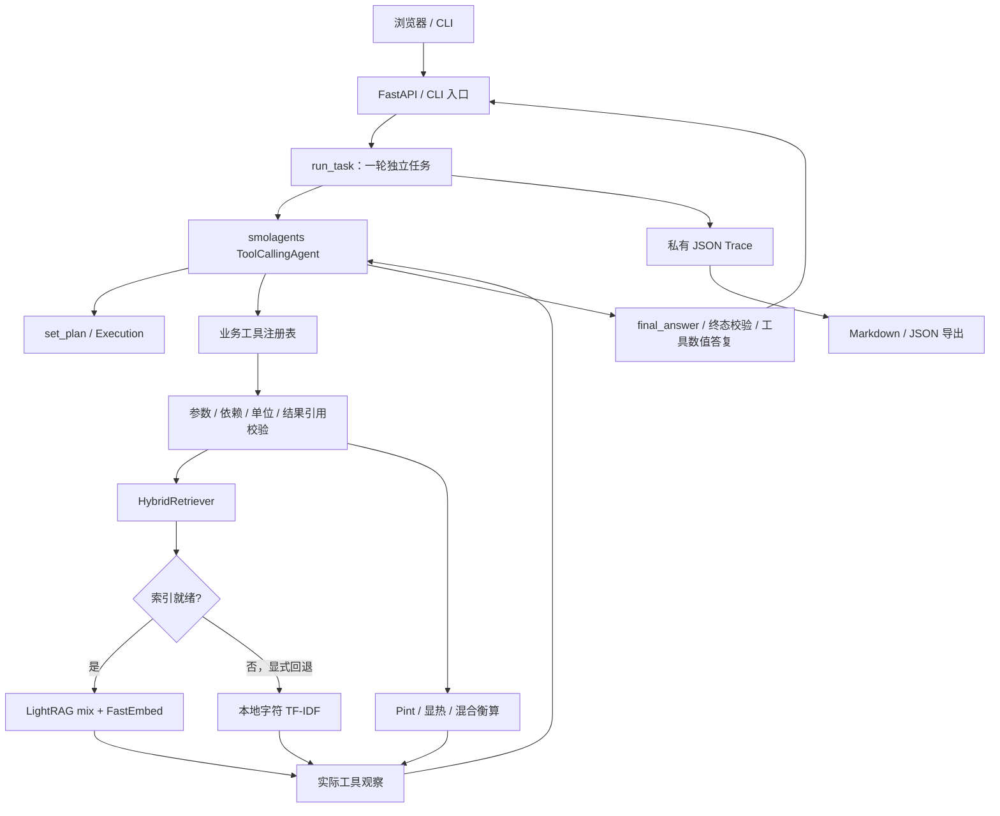

# 系统架构

版本：0.3.2。系统为本机单进程交付工程，知识问答与计算共用一条工具调用流程。

## 模块和实际职责

| 层 | 文件 | 职责 |
|---|---|---|
| 入口 | `cli.py`、`ui.py`、`app.py` | 配置、HTTP schema、Cookie 会话、任务槽、补参、取消、报告、健康检查 |
| 任务/Agent | `agent.py`、`model.py` | 独立任务、历史上下文、有限步骤、模型请求和超时、工具观察回传 |
| 工具与执行 | `tools.py`、`execution.py` | 注册四种业务工具、一次计划、前序依赖、参数签名、结果引用与终态 |
| 用户输入归因 | `inputs.py` | 在可信用户文本中匹配明确给定的质量比热，统一 J/kJ 单位，记录输入来源 |
| 检索 | `knowledge.py`、`retrieval.py` | MD/TXT、分段、来源与版本；LightRAG 结构化结果、真实来源映射、词法回退 |
| 数值与答复 | `calculations.py`、`answers.py` | 独立确定性函数、有限数值、量纲、绝对温度/温差、公式假设；成功工具结果生成计算答复 |
| 记录 | `trace.py`、`report.py` | 私有原始记录、脱敏、耗时、从已有成功工具输出生成报告 |
| 页面 | `web/` | 状态轮询、最新选择优先、幂等提交恢复、数值/说明/依据/路径 |

## 数据和状态

知识目录以 UTF-8 MD/TXT 为输入。来源保留真实相对路径；重复 doc_id 显式拒绝。知识版本基于路径与内容哈希。LightRAG 保存至 `build/lightrag/`，本地向量模型缓存位于 `.local/fastembed/`。索引首次构建需要模型与网络，查询可做模型关键词抽取；这些请求与主 Agent 的模型请求分别计数。向量、图谱、chunk 和来源存储离线检查失败时显示回退。SDK 共享数据隔离不改变已有磁盘文件结构，版本升级必须验证真实 SDK 存储测试。

一次任务为 `running`，终态为 completed、needs_input、no_evidence、out_of_scope、failed 或 cancelled。计划步骤记录 pending/running/succeeded/failed；检索执行成功不代表找到证据。依赖空检索的计算不能继续；空检索可更换查询重试。completed 要求计划成功且每个检索步骤有证据，引用来自本轮实际命中。终态不能通过再次调用最终工具改写；每次模型回复只接受一个工具调用。

`answers.requires_concept_explanation` 根据当前可信问题中明确的解释、区别、原理等表达设置完成要求，并排除指定的否定表达；它是窄规则，不是通用意图分类器。对于这类复合计算请求，`set_plan` 在保存计划前拒绝没有 `search_knowledge` 的计算计划，模型可重提包含检索的计划。`complete` 在生成数值答复前要求成功检索、实际引用和非空 `explanation`，防止概念解释只存在于被替换的模型 `answer` 中。最终工具的 `explanation` 仍为兼容的可选字段；普通数值任务可以省略。

`depends_on` 表示执行顺序，`input_refs` 才证明数值回用。例如 `s2.value` 的实际质量流量经单位校验注入热负荷，不重新抄写。换算之后若先进行混合衡算，下游可引用混合步骤的 `total_flow_kg_h` 或 `component_flow_kg_h`；执行器核对其来自已成功的声明依赖，并将 `kg/h` 换为 `kg/s`，不会强制使用混合前的换算值。图谱实体/边的来源若不在本轮命中中单列展示，不能作为命中数或事实验证结论。合并描述关联多个来源，来源集合不表示每份原文都支持整段描述；页面保留来源编号和原文供逐条核对。

补参带 parent_run_id 创建新运行，只传最近有限历史，不恢复执行器。会话属于内存，刷新可恢复，服务重启清空；运行记录仍在磁盘。单服务进程同时执行一个模型任务。可选 client_request_id 在当前会话保留的历史内阻止相同提交重复执行；过期/重启后的幂等历史不保存。

`run_task` 将当前问题及历史中角色为 user 的文本作为 `trusted_user_inputs` 传入执行器，助手历史和检索片段不参与比热归因。`calc_heat_duty` 执行前，`inputs.supplied_specific_heat` 匹配明确给定的质量比热数值及单位，支持 J 或 kJ 每 kg 每 K（或摄氏温差），统一为 `kJ/(kg·K)`。从最近消息向前匹配，最新明确值覆盖旧值；改值缺少或使用不支持的单位、明确未知或撤回、多个冲突值均不能悄悄复用旧值。匹配失败阻止实际热计算，要求模型使用 needs_input 请求补充。成功调用的 `input_provenance` 保存参数名、user 来源、用户消息下标、归一化数值及单位。

直接构造 `Execution` 且不传 `trusted_user_inputs` 时，保留低层结构化 API 的原有用法，仍做签名、数值、依赖、单位与结果引用校验，但不声称已将比热归因到用户文本。上述用户输入保护仅针对支持表达中的质量比热；不泛化为所有自然语言参数的语义归因。

## 错误、日志和边界

模型请求有超时与请求数上限，网络失败明确停止；工具参数错误可纠正后重试，没有自动无限计费重试。取消阻止后续工具，已发出的 HTTP 请求可能等到返回/超时。成功步骤保留，失败和取消不伪装为完成。

模型地址在配置加载时检查主机、端口、凭据和协议。无密钥或在执行前取消时，新建失败/取消记录标为 `not_started`，请求数为零；已经运行后失败的记录保留原模式和请求证据。`offline_demo` 和 `offline_smoke` 均不计作真实模型验收。

HTTP 返回 X-Request-ID，标准日志关联请求/任务和耗时，只记路由、状态及编号；原始正文、工具参数和输出只存入私有 trace，含检索、来源、错误状态与 model_requests，已知密钥脱敏。工具、模型及整轮耗时可从 trace 查看。/health 检查服务存活，不创建会话，也不调用模型；不是余额或远端模型就绪检查。

数值卡和报告表格取自真实成功工具返回。已完成数值任务的 answer 也由 answers.py 按成功工具输出、计算输入和完整适用条件生成；不解析模型文本，也不以显示舍入值重新计算。原模型答复作为 model_answer 留在私有记录，纯数值答复的 answer_source 为 verified_tools。explanation 保留复合问题的概念解释，另存 model_explanation，此时 answer_source 为 verified_tools_with_explanation。定量说明按句检查，每句需逐字匹配本轮已引用原文并标为来源原文（非本轮计算结果）；不同来源的定量句可与定性说明组合。不匹配的定量句拒绝最终答复，保持运行状态，允许改写重试。表达形式及原文成员检查不是通用语义验证。知识问答及非 completed 说明保留模型答复。模板不自动证明任意自由文本参数归因或物理过程满足工具假设，仍需核对输入与工况。知识卡不是自动物性数据库。当前无 PDF/OCR 上传、生产账号体系、数据库或通用数值语义验证；不把有限回归测试称为全主题准确率。

`scripts/validate_live.py` 验收原 8 案例、混合→换算→加热和温度换算与概念解释，共 10 案例。检查实际参数、`$ref` 与 `input_refs`、最终数值/单位/条件、概念解释及实际引用；工具批次拦截、失败工具与最终答复重试分别统计，恢复标志只表示执行终态，不能代替业务验收通过。可指定知识版本相同且就绪的源项目索引，当前代码、模型配置、知识及记录目录保持当前项目。报告保存所测提交和源码哈希。0.3.2 的离线验证为 361 项 Python、21 项前端测试通过，并通过 Ruff 与锁定依赖同步；当前证据见 [checks.json](validation/v0.3.2/checks.json) 和 [真实回归报告](validation/v0.3.2/live-regression-report.md)，0.3.1 记录仅是历史证据。

Docker 为同一程序提供单服务入口，非 root 运行；Compose 仅绑定本机端口，并持久保存 runs、索引与模型缓存。镜像构建上下文不包括 .env、原始 runs、缓存或本机索引。源码包保持显式白名单。运行命令和 API 用法见 README。
