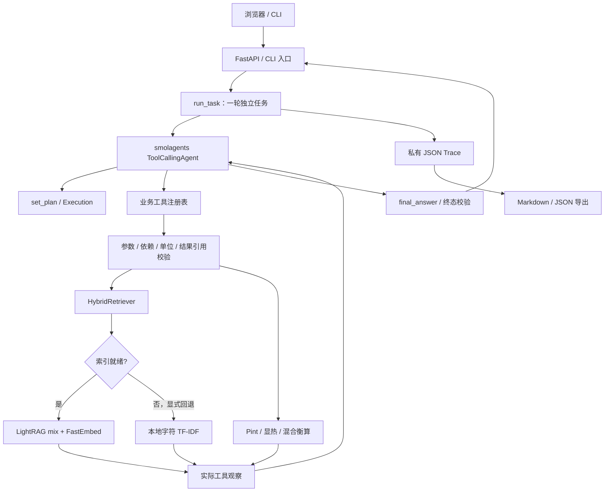

# 系统架构

版本：0.3.1。系统为本机单进程交付工程，知识问答与计算共用一条工具调用流程。

## 模块和实际职责

| 层 | 文件 | 职责 |
|---|---|---|
| 入口 | `cli.py`、`ui.py`、`app.py` | 配置、HTTP schema、Cookie 会话、任务槽、补参、取消、报告、健康检查 |
| 任务/Agent | `agent.py`、`model.py` | 独立任务、历史上下文、有限步骤、模型请求和超时、工具观察回传 |
| 工具与执行 | `tools.py`、`execution.py` | 注册四种业务工具、一次计划、前序依赖、参数签名、结果引用与终态 |
| 检索 | `knowledge.py`、`retrieval.py` | MD/TXT、分段、来源与版本；LightRAG 结构化结果、真实来源映射、词法回退 |
| 数值 | `calculations.py` | 独立确定性函数、有限数值、量纲、绝对温度/温差、公式假设 |
| 记录 | `trace.py`、`report.py` | 私有原始记录、脱敏、耗时、从已有成功工具输出生成报告 |
| 页面 | `web/` | 状态轮询、最新选择优先、幂等提交恢复、数值/说明/依据/路径 |

## 数据和状态

知识目录以 UTF-8 MD/TXT 为输入。来源保留真实相对路径；重复 doc_id 显式拒绝。知识版本基于路径与内容哈希。LightRAG 保存至 `build/lightrag/`，本地向量模型缓存位于 `.local/fastembed/`。索引首次构建需要模型与网络，查询可做模型关键词抽取；这些请求与主 Agent 的模型请求分别计数。向量、图谱、chunk 和来源存储离线检查失败时显示回退。SDK 共享数据隔离不改变已有磁盘文件结构，版本升级必须验证真实 SDK 存储测试。

一次任务为 `running`，终态为 completed、needs_input、no_evidence、out_of_scope、failed 或 cancelled。计划步骤记录 pending/running/succeeded/failed；检索执行成功不代表找到证据。依赖空检索的计算不能继续；空检索可更换查询重试。completed 要求计划成功且每个检索步骤有证据，引用来自本轮实际命中。终态不能通过再次调用最终工具改写；每次模型回复只接受一个工具调用。

`depends_on` 表示执行顺序，`input_refs` 才证明数值回用。例如 `s2.value` 的实际质量流量经单位校验注入热负荷，不重新抄写。换算之后若先进行混合衡算，下游可引用混合步骤的 `total_flow_kg_h` 或 `component_flow_kg_h`；执行器核对其来自已成功的声明依赖，并将 `kg/h` 换为 `kg/s`，不会强制使用混合前的换算值。图谱实体/边的来源若不在本轮命中中单列展示，不能作为命中数或事实验证结论。

补参带 parent_run_id 创建新运行，只传最近有限历史，不恢复执行器。会话属于内存，刷新可恢复，服务重启清空；运行记录仍在磁盘。单服务进程同时执行一个模型任务。可选 client_request_id 在当前会话保留的历史内阻止相同提交重复执行；过期/重启后的幂等历史不保存。

## 错误、日志和边界

模型请求有超时与请求数上限，网络失败明确停止；工具参数错误可纠正后重试，没有自动无限计费重试。取消阻止后续工具，已发出的 HTTP 请求可能等到返回/超时。成功步骤保留，失败和取消不伪装为完成。

模型地址在配置加载时检查主机、端口、凭据和协议。无密钥或在执行前取消时，新建失败/取消记录标为 `not_started`，请求数为零；已经运行后失败的记录保留原模式和请求证据。`offline_demo` 和 `offline_smoke` 均不计作真实模型验收。

HTTP 返回 X-Request-ID，标准日志关联请求/任务和耗时，只记路由、状态及编号；原始正文、工具参数和输出只存入私有 trace，含检索、来源、错误状态与 model_requests，已知密钥脱敏。工具、模型及整轮耗时可从 trace 查看。/health 检查服务存活，不创建会话，也不调用模型；不是余额或远端模型就绪检查。

数值卡和报告表格取自真实成功工具返回。模型说明仍可能误解用户输入、遗漏假设或写错数字，应与工具输入及输出核对。知识卡不是自动物性数据库。当前无 PDF/OCR 上传、生产账号体系、数据库或通用数值语义验证；不把有限回归测试称为全主题准确率。

Docker 为同一程序提供单服务入口，非 root 运行；Compose 仅绑定本机端口，并持久保存 runs、索引与模型缓存。镜像构建上下文不包括 .env、原始 runs、缓存或本机索引。源码包保持显式白名单。运行命令和 API 用法见 README。
