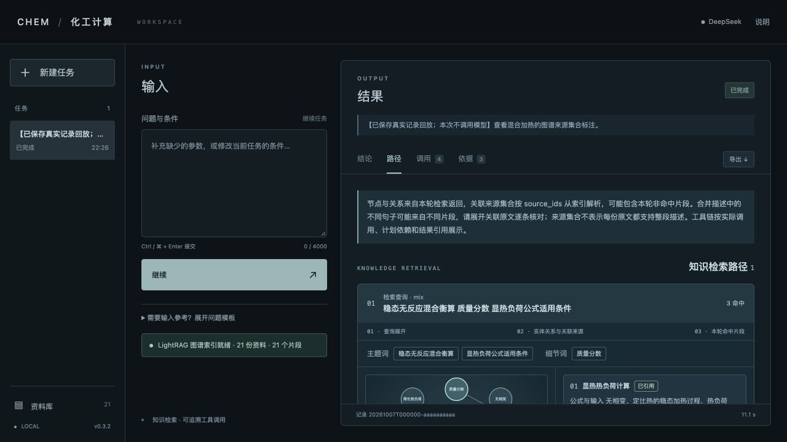
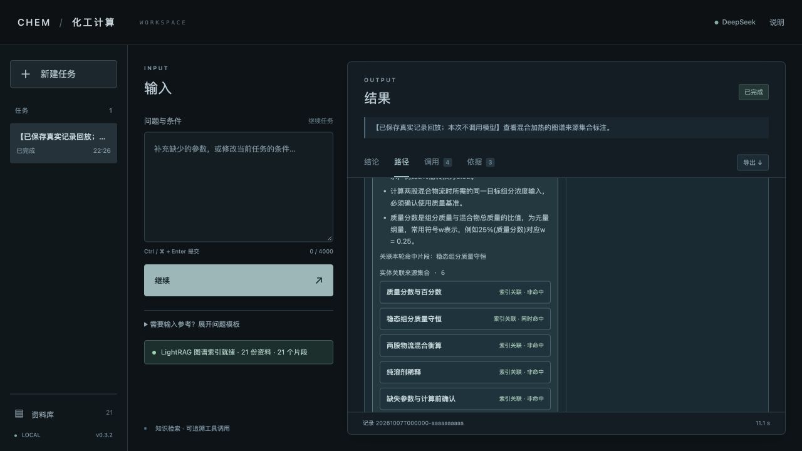

# 0.3.2 问题修复与真实复验

2026-10-07，使用用户原有有效凭据和 DeepSeek `deepseek-v4-pro`。完成原 8 案例、混合后加热、温度换算与概念解释，共 10 个主线案例；最后又对比热撤回、未知但含教材示例、更新为 2.5 做 3 个针对性案例。最后接受的 13 个案例均通过自动检查及限定人工核验，共 56 次主代理请求成功。

所有需要检索的成功计算实际使用 LightRAG `mix`，复用与当前 21 张知识卡版本一致的现有索引（21 片段、180 实体、235 关系）。数值、单位、引用链、适用条件和概念解释分别核对，不把模型 HTTP 成功等同于业务通过。

## 修复内容

- 数值答复从成功工具的实际结果和未舍入输入生成，保留全部假设。舍入值只用于展示，避免把舍入后的流量拼接成精确等式。原模型文本另存 `model_answer`。
- 热负荷完整显示单相、稳态、恒比热、无反应、无相变及忽略热损失、轴功、动能、位能；混合答复保留完全混合、无反应、无泄漏、无积累等前提。
- 概念解释独立保存在 `explanation` / `model_explanation`。明确要求解释的数值任务在登记计划前要求检索，完成时要求解释及真实引用，避免换算模板吞掉用户的追加问句。纯换算及“不要解释”保持旧接口兼容。
- 含数值的解释逐句匹配本轮已引用原文，可与定性说明组合；不匹配的错误指出具体句子，允许纠正后完成。
- 模型驱动热计算的比热核对当前问题及历史用户消息，排除助手和检索内容；支持带明确比热标签的 J/(kg·K)、kJ/(kg·K) 常见表达。记录 `input_provenance`，核对最新值，撤回、未知或缺单位的新值不会自动复用旧值。独立数值函数与直接结构化执行 API 保持兼容。
- 图谱页面用“索引关联”“来源集合”标注合并描述的关联资料，保留同时命中、非命中与未解析区分，并要求展开原文逐条核对。未声称每份关联原文支持描述的全部句子。

## 主线真实结果

完整 10 案例测试提交为 `956767d`，全部 43 次主代理请求成功。之后的 `6b232b4` 只收紧比热撤回及未知句式，新增离线回归，并对受影响的三个场景真实复验；没有把旧记录回查当成重新调用模型。各次实际源码 SHA256 和运行编号保存在 [summary](live-regression-summary.json)。

| 案例 | 实际结果 | 主代理请求 | 验收 |
|---|---|---:|---|
| 显热公式知识题 | 实际检索、真实片段引用 | 3 | 通过 |
| 1000 kg/h 加热 | 46.4444444444 kW，真实换算引用与完整前提 | 6 | 通过 |
| 改为 2000 kg/h | 92.8888888889 kW，未沿用旧流量 | 6 | 通过 |
| 混合衡算 | 500 kg/h，盐流量 5 kg/h，质量分数 0.01（1%） | 4 | 通过 |
| 压力换算 | 2.5 MPa → 2500 kPa | 4 | 通过 |
| 缺少比热 | needs_input，未执行热计算 | 1 | 通过 |
| 补充比热 | 46.4444444444 kW，比热来源为本次用户补参 | 6 | 通过 |
| 不兼容单位 | needs_input，无成功换算 | 1 | 通过 |
| 混合后加热 | 500 kg/h → 实际引用换算 → 23.2222222222 kW | 6 | 通过 |
| 温度换算与解释 | 25 degC → 298.15 K，保留温度点/温差和偏移抵消解释，实际引用 04/16 | 6 | 通过 |

主线记录中观测到 4 次多工具批次拦截、1 次未登记计划的单位工具调用失败、1 次遗漏解释的最终提交失败。5 个完成案例曾纠正错误后恢复。拦截事件与恢复结果均留在证据中；这不意味着模型第一次就按约束调用。

## 比热边界的最后针对性复验

最终运行时提交 `6b232b4` 的 3 个接受记录，共 13 次主代理请求成功：

| 场景 | 最后接受的真实结果 | 请求数 |
|---|---|---:|
| 历史比热 4.18 已撤回 | needs_input，未调用计算工具 | 1 |
| 用户改为 2.5 | 使用最新用户输入，27.7777777778 kW，来源索引为用户消息 1 | 6 |
| 比热未知，教材示例含 4.18 | 模型尝试提交 4.18，被执行器拒绝，最终 needs_input，无成功热输出 | 6 |

“比热未知”第一次尝试的第 2 次模型请求失败/超时，未执行计算；只重试这一例后通过。该失败原记录保留为失败，不能计作业务通过。包含前两轮失败与这一超时的全部本轮记录，共 34 个运行、168 次主代理请求（167 成功、1 失败）。LightRAG 内部关键词请求可能命中缓存，不在此计数内，也没有声称完整记录其次数。

## 修复过程中的失败证据

- `c2319cc` 首轮 7/10：逐段原文匹配拒绝了合法引用和概念说明的组合，2000 kg/h 与混合加热重试耗尽；温标问题漏检索且解释只写在原模型 `answer`，被数值模板覆盖。
- `14b9e3c` 第二轮 9/10：上述解释问题已通过，但缺参题提交并使用了未经用户提供的 4.18，与教学例题中的值相同。不能据此确定模型内部思考，但可确认输入缺少依据。
- `956767d` 第三轮 10/10：比热工具前核对用户来源，缺参题明确请求补充；随后针对撤回和未知句式完善至 `6b232b4`，按受影响场景复验。

[脱敏证据](live-regression-evidence.json) 保留这些失败及最后通过记录的计划、工具参数/输出/引用、实际来源、用户最终答案、原模型答案、请求状态和去重后的错误观察；省略重复模型请求历史。原始记录仅保存在忽略目录 `runs/`，密钥、本机路径和原始缓存未进入交付。

## 离线及人工核验范围

当前最终代码通过 361 项 Python、21 项前端测试、Ruff、格式、JavaScript 语法、diff 检查及锁定离线依赖同步。Python 包含真实 SDK 的离线存储/查询适配、API→脚本模型→真实工具→导出集成及实际无网络 Docker scratch 上下文回归；这些测试不冒充真实模型质量评测。源码包已在独立临时目录新建虚拟环境，使用本机既有 Python 3.12.14 与共享包缓存锁定离线安装；不复制凭据。doctor、2000 kg/h 演示及全部 361 项 Python/21 项前端测试通过，包内源码、测试、资料和依赖哈希匹配。首次隔离 PATH 未找到解释器，显式指定已验证的解释器后安装通过；未声称验证新操作系统。完整环境与交付检查见 [checks](checks.json)。

人工核对主线 71 条、针对性接受记录 21 条检索/图谱来源均等于持久索引及当前知识文件，所有关联编号可解析。核对数值、完整前提、混合与换算实际 `$ref`、补参/改值的 `input_provenance`，并阅读温标最终解释。该解释中的固定偏移适用于本题摄氏温度转 K；温差相减抵消偏移的说明有实际来源。引文身份正确不代表每条推论已被自动语义证明。

比热核对是限定表达匹配；复杂多物质、范围、间接陈述或未支持单位可能要求澄清。数值工具本身不验证工况物性真值；其他自由文本参数归因、任意知识主张的逐句支持仍需人工核对。本轮不是全主题检索准确率基准。

## 图谱界面回放验证

下面使用当前 v0.3.2 页面回放第二轮保存的真实混合加热记录（`20261007T141255-e9aa9ca959`），只验证来源集合标注和呈现，不发起新的模型请求。页内明确标为回放；这不作为新增真实模型案例。

